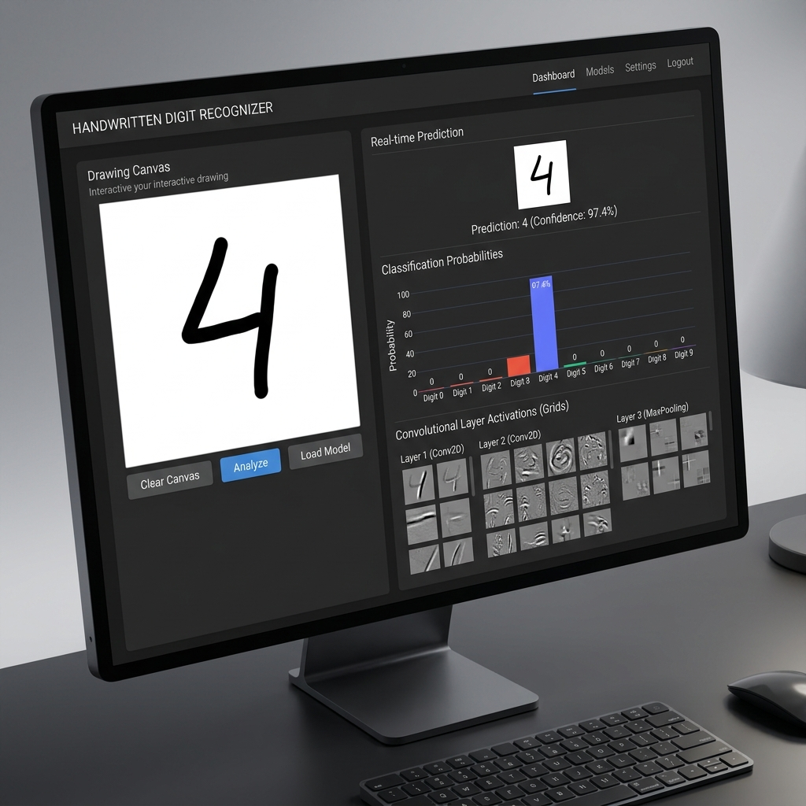
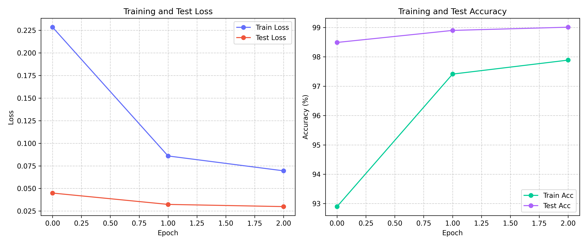

# ✍️ MNIST Interactive Digit Recognition System

[](https://www.python.org/)
[](https://pytorch.org/)
[](https://streamlit.io/)
[](https://plotly.com/)
[](https://mnist-handwritten-numbers-fjeg3fbd7mbi5w7uggne8y.streamlit.app/)

🚀 **Live Demo**: [mnist-handwritten-numbers.streamlit.app](https://mnist-handwritten-numbers-fjeg3fbd7mbi5w7uggne8y.streamlit.app/)

An end-to-end, high-performance Convolutional Neural Network (CNN) trained on the MNIST dataset, integrated with a clean, responsive Streamlit dashboard. The application provides an interactive drawing canvas and an image uploader, performing real-time classification and visualizing intermediate network activations (feature maps) to demystify what the network "sees."

---

## 📸 Application Mockup



---

## ✨ Features

- **🏆 99.38% Accuracy CNN**: A multi-layer PyTorch CNN featuring 2D convolutions, max-pooling, and dropout regularization, reaching top-tier validation accuracy in just 3 epochs.
- **⚙️ Bounding-Box Scaling & Center-of-Mass Shifting**: Preprocesses drawings to align with MNIST formatting. Instead of naive resizing, it isolates the drawn digit, normalizes it to a 20x20 bounding box, and shifts its center of mass to coordinates `(14, 14)` on a blank 28x28 grid.
- **📤 Smart Upload Inversion**: Drag-and-drop custom digit images. The backend computes edge pixel brightness to dynamically invert light backgrounds, ensuring compatibility with images written on white paper.
- **📊 Interactive Analytics**: Real-time confidence scores plotted using a Plotly bar chart styled natively with the Streamlit theme.
- **🔍 Activation Map Grid**: Dynamically displays grids of the first and second conv layer activations, providing visual insight into how the network extracts features (edges, curves, loops).
- **☁️ Google Colab Integration**: An optimized Jupyter Notebook with GPU support and automatic file download hooks to save trained weights back to your local workspace.

---

## 🛠️ The Math Behind Preprocessing

One of the main flaws with hand-drawn canvas digit classifiers is off-center placement and thin strokes. The original MNIST dataset preprocessed digits by:
1. Fitting the digit inside a $20 \times 20$ bounding box while preserving the aspect ratio.
2. Centering the digit in a $28 \times 28$ canvas by calculating the **Center of Mass** ($C_x, C_y$) of the pixel intensities and translating the image so that this point aligns with the grid center $(14, 14)$.

This project implements a pure-Python/NumPy equivalent:

```python
# Calculate center of mass of the resized digit
y_indices, x_indices = np.where(digit_arr > 10)
weights = digit_arr[y_indices, x_indices]
cy = np.average(y_indices, weights=weights)
cx = np.average(x_indices, weights=weights)

# Calculate placement offset (Target center is 14.0, 14.0)
start_y = int(round(14.0 - cy))
start_x = int(round(14.0 - cx))
```

---

## 🧠 Model Architecture

The CNN is defined in [model.py](model.py) and is structured as follows:

| Layer | Type | Specifications | Output Shape |
| :--- | :--- | :--- | :--- |
| **Input** | Grayscale Image | MNIST Normalized | `(1, 28, 28)` |
| **Conv 1** | 2D Convolution | 32 filters, 3x3 kernel, padding=1 | `(32, 28, 28)` |
| **Pooling 1** | Max Pooling | 2x2 kernel, stride=2 | `(32, 14, 14)` |
| **Conv 2** | 2D Convolution | 64 filters, 3x3 kernel, padding=1 | `(64, 14, 14)` |
| **Pooling 2** | Max Pooling | 2x2 kernel, stride=2 | `(64, 7, 7)` |
| **Dropout 1** | Dropout Regularization | 25% drop rate | `(64, 7, 7)` |
| **FC 1** | Fully Connected | Linear projection (3136 → 128) + ReLU | `(128,)` |
| **Dropout 2** | Dropout Regularization | 50% drop rate | `(128,)` |
| **FC 2** | Fully Connected | Output projection (128 → 10 digits) | `(10,)` |

---

## 📈 Training Performance

The model training utilizes **Cross-Entropy Loss**, **Adam Optimizer**, and **Early Stopping** (patience = 3).

### Epoch-by-Epoch Progress:

| Epoch | Train Loss | Train Acc | Test Loss | Test Acc | Status |
| :--- | :--- | :--- | :--- | :--- | :--- |
| Epoch 1 | 0.2389 | 92.64% | 0.0539 | 98.20% | Saved Checkpoint |
| Epoch 2 | 0.0858 | 97.48% | 0.0348 | 98.86% | Saved Checkpoint |
| Epoch 3 | 0.0671 | 98.00% | 0.0312 | 98.94% | Saved Checkpoint |
| Epoch 4 | 0.0566 | 98.34% | 0.0253 | 99.10% | Saved Checkpoint |
| Epoch 5 | 0.0485 | 98.53% | 0.0241 | 99.12% | Saved Checkpoint |
| Epoch 6 | 0.0440 | 98.61% | 0.0228 | 99.25% | Saved Checkpoint |
| Epoch 7 | 0.0392 | 98.77% | 0.0211 | 99.17% | Saved Checkpoint |
| Epoch 8 | 0.0363 | 98.86% | 0.0251 | 99.15% | Early Stopping Counter: 1 |
| Epoch 9 | 0.0332 | 98.94% | **0.0203** | 99.30% | **Best Checkpoint Saved** |
| Epoch 10 | 0.0316 | 98.96% | 0.0220 | 99.23% | Early Stopping Counter: 1 |
| Epoch 11 | 0.0276 | 99.12% | 0.0211 | **99.38%** | Early Stopping Counter: 2 |
| Epoch 12 | 0.0278 | 99.11% | 0.0223 | 99.31% | Early Stopping Counter: 3 (Halted) |



---

## 🚀 Installation & Local Execution

### 1. Install Dependencies
```bash
pip install -r requirements.txt
```

### 2. Train the Model
- **Google Colab (Recommended)**: Open `mnist_training.ipynb` in Colab, configure runtime to **T4 GPU**, and run the cells. The last cell will prompt you to download the trained `mnist_cnn.pth` and `training_history.png` directly.
- **Local CPU/GPU**: Run the command line script:
  ```bash
  python train.py
  ```

### 3. Launch Streamlit Web App
Ensure `mnist_cnn.pth` is in the project root, then run:
```bash
streamlit run app.py
```
Open `http://localhost:8501` in your browser. The app dynamically reloads the model weights if you re-train and update `mnist_cnn.pth`.
